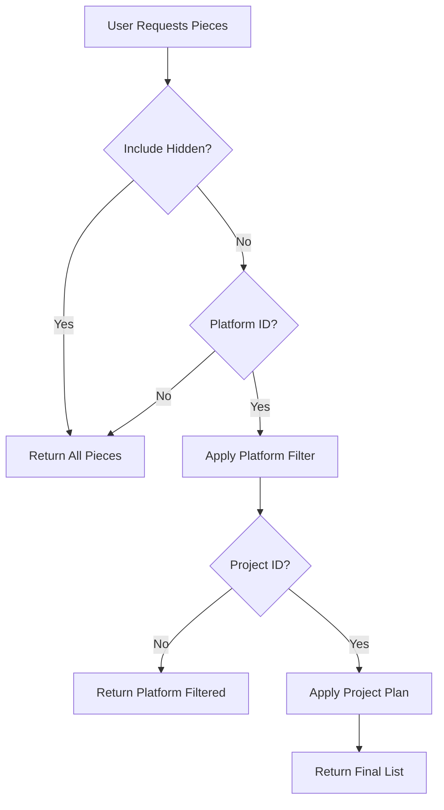

Pieces are integrations in Activepieces. Platform and project administrators can control which pieces are available to users through filtering and private registries.

## Overview

Activepieces provides three levels of piece filtering:

<CardGroup cols={3}>
  <Card title="Platform Level" icon="building">
    Global piece filtering for entire platform
  </Card>
  <Card title="Project Level" icon="folder">
    Per-project piece restrictions
  </Card>
  <Card title="Private Registry" icon="lock">
    Custom piece deployment
  </Card>
</CardGroup>

## Platform Piece Filtering

Control which pieces are available across your platform:

### Filter Behaviors

<Tabs>
  <Tab title="Allowed (Whitelist)">
    ### Allow Specific Pieces
    
    Only specified pieces are available:
    
    ```typescript
    {
      filteredPieceBehavior: FilteredPieceBehavior.ALLOWED,
      filteredPieceNames: [
        "@activepieces/piece-slack",
        "@activepieces/piece-gmail",
        "@activepieces/piece-google-sheets",
        "@activepieces/piece-hubspot"
      ]
    }
    ```
    
    **Use Cases:**
    - Security compliance requirements
    - Limiting integrations to approved vendors
    - Controlling data flow to specific services
  </Tab>
  
  <Tab title="Blocked (Blacklist)">
    ### Block Specific Pieces
    
    All pieces available except blocked ones:
    
    ```typescript
    {
      filteredPieceBehavior: FilteredPieceBehavior.BLOCKED,
      filteredPieceNames: [
        "@activepieces/piece-dropbox",
        "@activepieces/piece-box"
      ]
    }
    ```
    
    **Use Cases:**
    - Blocking competing services
    - Preventing data exfiltration to specific vendors
    - Regulatory compliance
  </Tab>
</Tabs>

<Warning>
Platform filtering is deprecated in favor of project-level filtering, which provides more granular control.
</Warning>

## Project Piece Plans

Configure piece availability per project for fine-grained control:

### Creating a Project Plan

```typescript
{
  projectId: "proj_abc123",
  name: "Enterprise Security Plan",
  piecesFilterType: PiecesFilterType.ALLOWED,
  pieces: [
    "@activepieces/piece-slack",
    "@activepieces/piece-microsoft-teams",
    "@activepieces/piece-salesforce"
  ],
  locked: false
}
```

### Filter Types

<Tabs>
  <Tab title="NONE">
    ### No Filtering (Default)
    
    All platform pieces are available:
    
    ```typescript
    {
      piecesFilterType: PiecesFilterType.NONE,
      pieces: []  // Empty array
    }
    ```
    
    Best for:
    - Development environments
    - Unrestricted projects
    - Maximum flexibility
  </Tab>
  
  <Tab title="ALLOWED">
    ### Allowlist Mode
    
    Only specified pieces are available:
    
    ```typescript
    {
      piecesFilterType: PiecesFilterType.ALLOWED,
      pieces: [
        "@activepieces/piece-http",
        "@activepieces/piece-data-mapper",
        "@activepieces/piece-slack"
      ]
    }
    ```
    
    Best for:
    - Production environments
    - Compliance requirements
    - Customer-specific integrations
  </Tab>
</Tabs>

### Plan Locking

Lock plans to prevent modifications:

```typescript
{
  locked: true  // Plan cannot be changed
}
```

<Info>
Locked plans ensure compliance policies cannot be bypassed by project administrators.
</Info>

## Installing Pieces

### Community Pieces

Activepieces includes 200+ community pieces:

<Steps>
  <Step title="Browse Available Pieces">
    View all pieces in the piece marketplace:
    
    ```bash
    GET /v1/pieces
    ```
  </Step>
  
  <Step title="Check Piece Availability">
    Pieces are automatically available based on filtering rules
  </Step>
  
  <Step title="Use in Flows">
    Add pieces to flows through the flow builder
  </Step>
</Steps>

### Private Pieces

Deploy custom pieces to your platform:

<Steps>
  <Step title="Build Custom Piece">
    Create piece using the Activepieces CLI:
    
    ```bash
    npx @activepieces/cli create-piece my-custom-piece
    ```
  </Step>
  
  <Step title="Publish to Registry">
    ```bash
    npx @activepieces/cli publish-piece \
      --path ./my-custom-piece \
      --registry https://your-registry.com
    ```
  </Step>
  
  <Step title="Configure Platform">
    Point platform to your private registry:
    
    ```bash
    AP_PIECES_SOURCE=PRIVATE
    AP_PRIVATE_PIECES_REGISTRY=https://your-registry.com
    ```
  </Step>
</Steps>

## Piece Filtering Logic

The system applies filters in this order:



### Filtering Rules

<Steps>
  <Step title="Platform Filter">
    If platform has `ALLOWED` behavior:
    - Only pieces in `filteredPieceNames` are included
    
    If platform has `BLOCKED` behavior:
    - All pieces except those in `filteredPieceNames`
  </Step>
  
  <Step title="Project Filter">
    If project has `ALLOWED` filter:
    - Only pieces in project plan's `pieces` array
    
    If project has `NONE` filter:
    - All pieces from platform filter
  </Step>
  
  <Step title="Hidden Pieces">
    If `includeHidden=true`:
    - All filters bypassed (admin view)
  </Step>
</Steps>

## Managing Piece Allowlists

### Adding Pieces to Allowlist

<CodeGroup>
```bash Platform Level
curl -X PATCH 'https://api.activepieces.com/v1/platforms/{platformId}' \
  -H 'Authorization: Bearer {token}' \
  -H 'Content-Type: application/json' \
  -d '{
    "filteredPieceBehavior": "ALLOWED",
    "filteredPieceNames": [
      "@activepieces/piece-slack",
      "@activepieces/piece-gmail"
    ]
  }'
```

```bash Project Level
curl -X PATCH 'https://api.activepieces.com/v1/project-plans/{planId}' \
  -H 'Authorization: Bearer {token}' \
  -H 'Content-Type: application/json' \
  -d '{
    "piecesFilterType": "ALLOWED",
    "pieces": [
      "@activepieces/piece-http",
      "@activepieces/piece-slack"
    ]
  }'
```
</CodeGroup>

### Common Piece Combinations

<AccordionGroup>
  <Accordion title="Essential Workflow Pieces">
    ```json
    [
      "@activepieces/piece-http",
      "@activepieces/piece-data-mapper",
      "@activepieces/piece-webhook",
      "@activepieces/piece-delay",
      "@activepieces/piece-date-helper",
      "@activepieces/piece-text-helper"
    ]
    ```
  </Accordion>
  
  <Accordion title="Business Communication">
    ```json
    [
      "@activepieces/piece-slack",
      "@activepieces/piece-microsoft-teams",
      "@activepieces/piece-gmail",
      "@activepieces/piece-smtp"
    ]
    ```
  </Accordion>
  
  <Accordion title="CRM & Sales">
    ```json
    [
      "@activepieces/piece-salesforce",
      "@activepieces/piece-hubspot",
      "@activepieces/piece-pipedrive",
      "@activepieces/piece-zoho-crm"
    ]
    ```
  </Accordion>
  
  <Accordion title="Data & Storage">
    ```json
    [
      "@activepieces/piece-google-sheets",
      "@activepieces/piece-airtable",
      "@activepieces/piece-postgresql",
      "@activepieces/piece-mysql",
      "@activepieces/piece-mongodb"
    ]
    ```
  </Accordion>
</AccordionGroup>

## Private Piece Registry

Host your own piece registry for custom integrations:

### Registry Setup

<Steps>
  <Step title="Choose Registry Type">
    Options:
    - npm private registry
    - Verdaccio
    - Artifactory
    - GitHub Packages
  </Step>
  
  <Step title="Configure Environment">
    ```bash
    # Use private registry
    AP_PIECES_SOURCE=PRIVATE
    AP_PRIVATE_PIECES_REGISTRY=https://registry.company.com
    
    # Authentication (if required)
    NPM_TOKEN=your-token-here
    ```
  </Step>
  
  <Step title="Publish Custom Pieces">
    ```bash
    cd my-custom-piece
    npm publish --registry https://registry.company.com
    ```
  </Step>
</Steps>

### Registry Configuration

```typescript
// .npmrc for custom registry
registry=https://registry.company.com
//registry.company.com/:_authToken=${NPM_TOKEN}
```

## Piece Metadata

Each piece has metadata that affects filtering:

```typescript
{
  name: "@activepieces/piece-slack",
  displayName: "Slack",
  version: "0.9.0",
  minimumSupportedRelease: "0.20.0",
  maximumSupportedRelease: "999.0.0",
  auth: { type: "OAUTH2" },
  actions: [...],
  triggers: [...]
}
```

### Hidden Pieces

Some pieces are hidden from normal users:

```typescript
const isHidden = piece.name.startsWith('@activepieces/piece-internal-')
```

## Checking Piece Availability

Verify if a piece is available to a project:

```typescript
const isFiltered = await enterpriseFilteringUtils.isFiltered({
  piece: pieceMetadata,
  projectId: "proj_abc123",
  platformId: "platform_123"
})

if (isFiltered) {
  throw new Error('Piece not available in this project')
}
```

## Use Cases

<AccordionGroup>
  <Accordion title="Multi-Tenant SaaS">
    **Scenario:** Offer different piece sets per pricing tier
    
    **Implementation:**
    - Free tier: Core pieces only
    - Pro tier: + Business integrations
    - Enterprise: All pieces + custom pieces
    
    ```typescript
    const freeTierPlan = {
      piecesFilterType: PiecesFilterType.ALLOWED,
      pieces: ['@activepieces/piece-http', '@activepieces/piece-webhook']
    }
    ```
  </Accordion>
  
  <Accordion title="Security Compliance">
    **Scenario:** Restrict data flow to approved vendors only
    
    **Implementation:**
    Block all pieces, then allowlist approved ones:
    
    ```typescript
    {
      piecesFilterType: PiecesFilterType.ALLOWED,
      pieces: approvedVendorPieces,
      locked: true  // Prevent changes
    }
    ```
  </Accordion>
  
  <Accordion title="Custom Integrations">
    **Scenario:** Provide internal system integrations
    
    **Implementation:**
    - Deploy private pieces to custom registry
    - Make available only to specific projects
    
    ```typescript
    {
      pieces: [
        '@company/piece-internal-crm',
        '@company/piece-erp-system'
      ]
    }
    ```
  </Accordion>
  
  <Accordion title="Regional Restrictions">
    **Scenario:** Comply with data residency laws
    
    **Implementation:**
    Block pieces that transfer data outside region:
    
    ```typescript
    {
      filteredPieceBehavior: FilteredPieceBehavior.BLOCKED,
      filteredPieceNames: nonCompliantPieces
    }
    ```
  </Accordion>
</AccordionGroup>

## API Reference

<CodeGroup>
```bash List Available Pieces
curl -X GET 'https://api.activepieces.com/v1/pieces?projectId={projectId}' \
  -H 'Authorization: Bearer {token}'
```

```bash Get Piece Details
curl -X GET 'https://api.activepieces.com/v1/pieces/{pieceName}' \
  -H 'Authorization: Bearer {token}'
```

```bash Update Project Plan
curl -X PATCH 'https://api.activepieces.com/v1/project-plans/{planId}' \
  -H 'Authorization: Bearer {token}' \
  -H 'Content-Type: application/json' \
  -d '{
    "pieces": ["@activepieces/piece-slack"],
    "piecesFilterType": "ALLOWED"
  }'
```
</CodeGroup>

## Best Practices

<CardGroup cols={2}>
  <Card title="Start Restrictive" icon="lock">
    Begin with allowlist mode and add pieces as needed, rather than blocking later.
  </Card>
  
  <Card title="Lock Production" icon="key">
    Lock project plans in production to prevent unauthorized changes.
  </Card>
  
  <Card title="Document Allowlists" icon="book">
    Maintain documentation of why each piece is allowed/blocked.
  </Card>
  
  <Card title="Regular Reviews" icon="rotate">
    Audit piece usage quarterly and update allowlists accordingly.
  </Card>
</CardGroup>

## Troubleshooting

<AccordionGroup>
  <Accordion title="Piece Not Appearing">
    **Check:**
    1. Platform filter includes the piece
    2. Project plan allows the piece
    3. Piece name is spelled correctly
    4. User has permission to view pieces
  </Accordion>
  
  <Accordion title="Custom Piece Not Loading">
    **Check:**
    1. Private registry is accessible
    2. NPM_TOKEN is set correctly
    3. Piece is published to registry
    4. Piece version is compatible
  </Accordion>
  
  <Accordion title="Users See Wrong Pieces">
    **Check:**
    1. Project plan is configured correctly
    2. Platform filter is not too restrictive
    3. User is in the correct project
    4. Cache has been cleared
  </Accordion>
</AccordionGroup>

## Related Topics

<CardGroup cols={3}>
  <Card title="Project Management" icon="folder" href="/admin/projects">
    Configure project plans
  </Card>
  <Card title="Security Practices" icon="shield" href="/admin/security-practices">
    Security considerations
  </Card>
  <Card title="Building Pieces" icon="hammer" href="/pieces/introduction">
    Create custom pieces
  </Card>
</CardGroup>