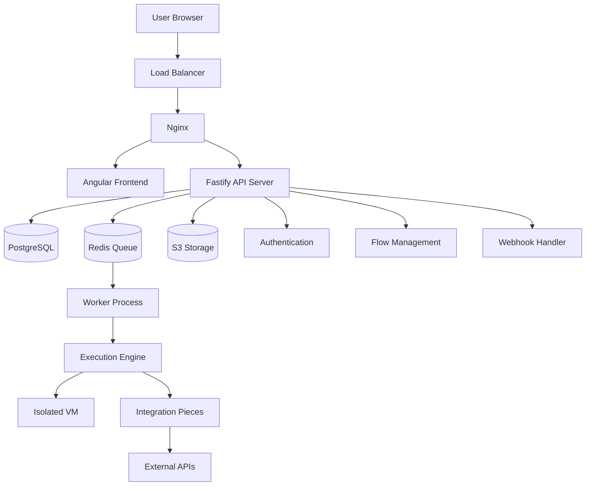
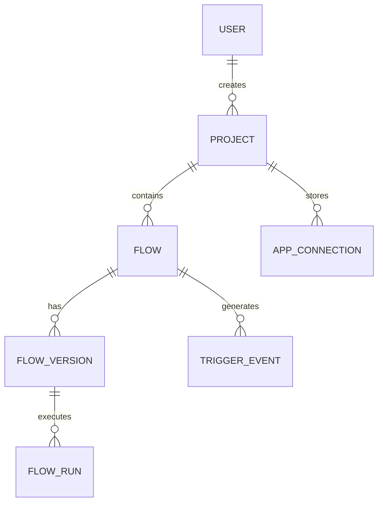
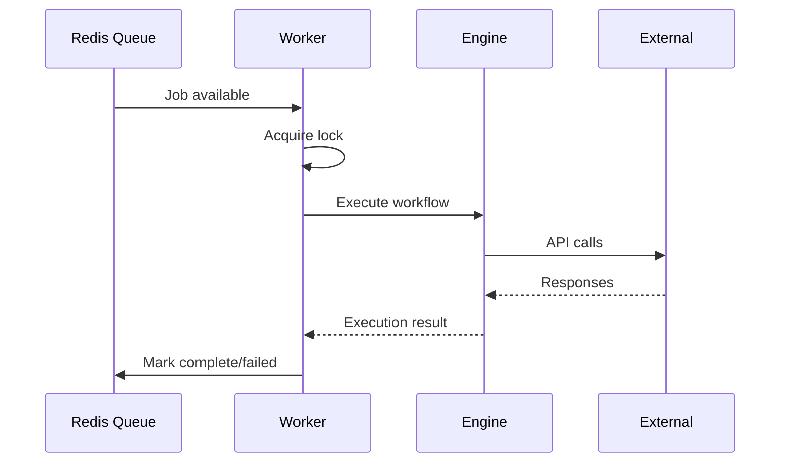
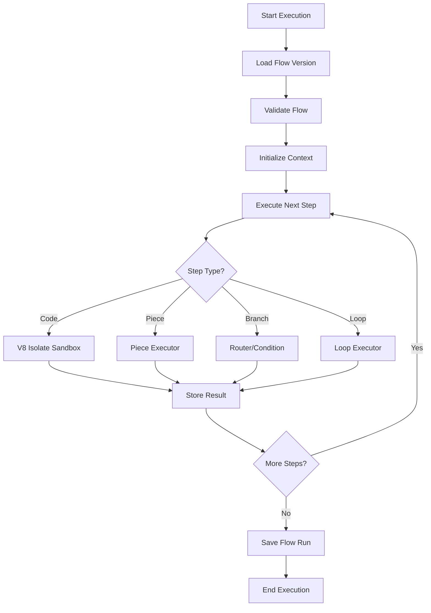
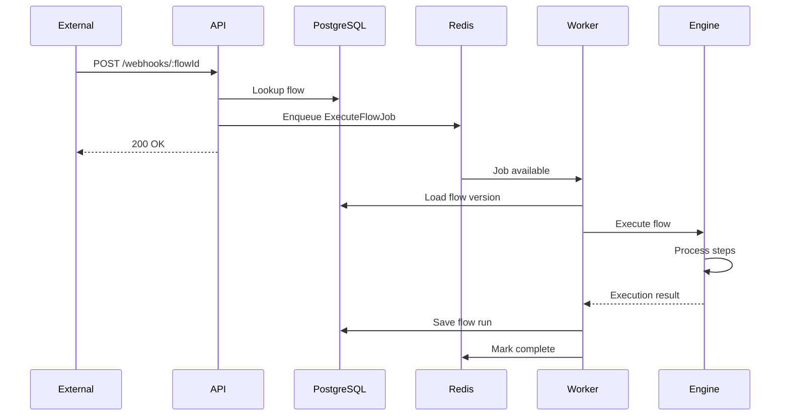
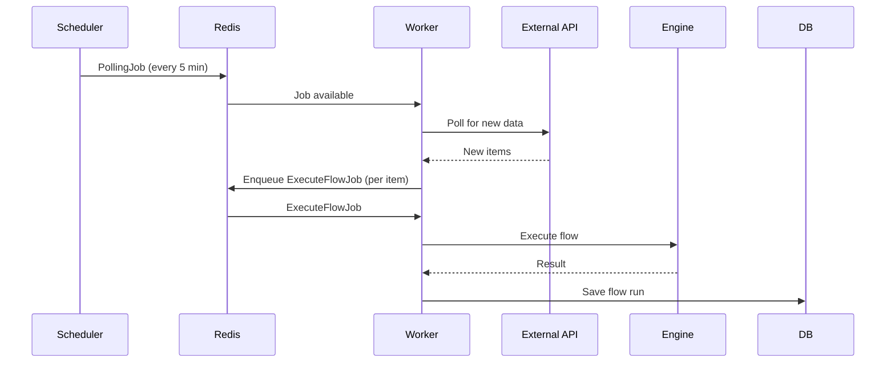
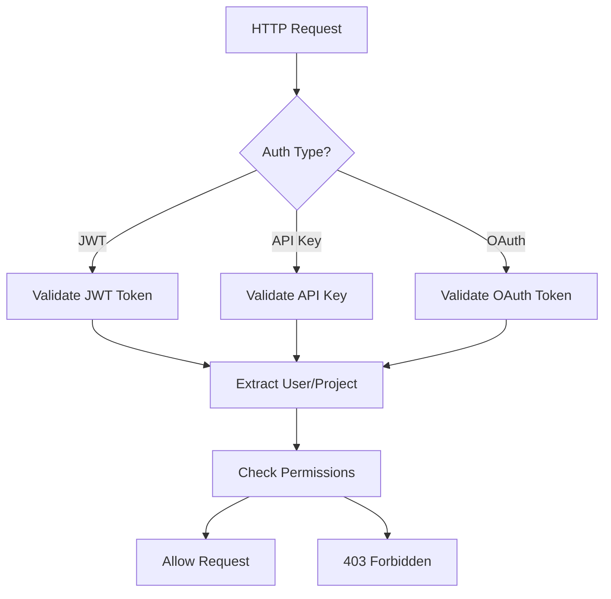

Activepieces is built as a modular, scalable workflow automation platform. This guide explains the core components and how they interact.

## High-Level Architecture



## Core Components

### 1. Frontend (Angular + Nginx)

<ParamField path="Frontend" type="component">
  **Technology**: Angular 17+ with Angular Material
  
  **Location**: `packages/web/`
  
  **Responsibilities**:
  - Visual flow builder (drag-and-drop interface)
  - Execution logs viewer
  - User management
  - Configuration UI
  - Real-time updates via WebSockets
  
  **Deployment**:
  - Built to static files in `dist/packages/web/`
  - Served by Nginx on port 80
  - Gzipped and optimized for production
</ParamField>

Nginx configuration (`nginx.react.conf`):

```nginx
worker_processes auto;

events {
    worker_connections 1024;
}

http {
    include mime.types;
    default_type application/octet-stream;
    
    # Serve frontend
    server {
        listen 80;
        root /usr/share/nginx/html;
        index index.html;
        
        # SPA routing
        location / {
            try_files $uri $uri/ /index.html;
        }
        
        # Proxy API requests
        location /api/ {
            proxy_pass http://localhost:3000;
            proxy_http_version 1.1;
            proxy_set_header Upgrade $http_upgrade;
            proxy_set_header Connection 'upgrade';
        }
    }
}
```

### 2. API Server (Fastify + Node.js)

<ParamField path="API Server" type="component">
  **Technology**: Node.js 20 with Fastify framework
  
  **Location**: `packages/server/api/`
  
  **Entry Point**: `src/bootstrap.ts` → `src/main.ts`
  
  **Responsibilities**:
  - RESTful API endpoints
  - User authentication (JWT)
  - Flow CRUD operations
  - Webhook receivers
  - Job scheduling to Redis
  - File uploads/downloads
  - OAuth flows
  - WebSocket connections
  
  **Port**: 3000 (internal), proxied through Nginx on port 80
</ParamField>

Key modules:

<AccordionGroup>
  <Accordion title="Authentication" icon="lock">
    **Location**: `app/authentication/`
    
    - JWT token generation/validation
    - OAuth 2.0 flows (Google, GitHub)
    - API key authentication
    - User identity management
    - Session handling
    
    **Security**:
    - bcrypt password hashing
    - JWT with configurable expiration
    - Rate limiting on auth endpoints
  </Accordion>
  
  <Accordion title="Flow Management" icon="diagram-project">
    **Location**: `app/flows/`
    
    - Flow entity: Workflow definitions
    - FlowVersion entity: Immutable versions
    - FlowRun entity: Execution records
    - Folder entity: Organization
    
    **Features**:
    - Versioning system
    - Draft/published states
    - Import/export
    - Templates
  </Accordion>
  
  <Accordion title="Webhook Handler" icon="webhook">
    **Location**: `app/webhooks/`
    
    - Dynamic webhook endpoint creation
    - Payload validation
    - Trigger matching
    - Handshake/verification flows
    - Replay protection
    
    **Endpoint**: `POST /api/v1/webhooks/:flowId/:simulate?`
  </Accordion>
  
  <Accordion title="Pieces (Integrations)" icon="puzzle-piece">
    **Location**: `app/pieces/`
    
    - Piece metadata management
    - Dynamic piece loading
    - Version compatibility
    - Piece installation/updates
    
    **Piece Types**:
    - Community pieces
    - Custom pieces
    - Enterprise pieces
  </Accordion>
</AccordionGroup>

### 3. Database (PostgreSQL)

<ParamField path="Database" type="component">
  **Technology**: PostgreSQL 14+
  
  **ORM**: TypeORM
  
  **Location**: `app/database/`
  
  **Key Tables**:
  - `flow`: Workflow definitions
  - `flow_version`: Immutable workflow versions
  - `flow_run`: Execution logs and results
  - `user`: User accounts
  - `project`: Workspaces/projects
  - `app_connection`: OAuth tokens and API keys
  - `trigger_event`: Queued trigger events
  - `file`: File metadata
  - `store_entry`: Key-value storage
  
  **Migrations**: Located in `app/database/migration/`
  
  Automatically applied on startup via TypeORM.
</ParamField>

Entity relationships:



### 4. Job Queue (Redis + BullMQ)

<ParamField path="Job Queue" type="component">
  **Technology**: Redis 7+ with BullMQ library
  
  **Location**: `app/workers/queue/`
  
  **Job Types**:
  - `ExecuteFlowJob`: Workflow executions
  - `PollingJob`: Scheduled trigger polling
  - `WebhookJob`: Webhook-triggered flows
  - `RenewWebhookJob`: Webhook renewal
  - `UserInteractionJob`: Human-in-the-loop tasks
  - `EventDestinationJob`: Event forwarding
  
  **Features**:
  - Job prioritization
  - Delayed jobs
  - Job retries with exponential backoff
  - Job dependencies
  - Cron-based scheduling
  - Rate limiting
</ParamField>

Queue structure:

```
Redis
  ├── bull:activepieces:waiting      # Pending jobs
  ├── bull:activepieces:active       # Currently processing
  ├── bull:activepieces:completed    # Finished successfully
  ├── bull:activepieces:failed       # Failed jobs
  ├── bull:activepieces:delayed      # Scheduled for future
  └── bull:activepieces:repeat       # Recurring jobs
```

### 5. Worker Processes

<ParamField path="Workers" type="component">
  **Location**: `app/workers/`
  
  **Responsibilities**:
  - Consume jobs from Redis queue
  - Execute workflows via Engine
  - Handle polling triggers
  - Renew webhook subscriptions
  - Process scheduled tasks
  
  **Concurrency**: Configurable via `AP_WORKER_CONCURRENCY`
  
  **Scaling**: Horizontal scaling by adding more worker containers
</ParamField>

Worker lifecycle:



### 6. Execution Engine

<ParamField path="Engine" type="component">
  **Location**: `packages/server/engine/`
  
  **Entry Point**: `src/main.ts`
  
  **Technology**: Node.js with isolated-vm for sandboxing
  
  **Responsibilities**:
  - Parse flow definitions
  - Execute steps sequentially
  - Handle branching (router steps)
  - Loop processing
  - Error handling and retries
  - Code step execution (sandboxed)
  - Piece action execution
  
  **Execution Path**: `AP_ENGINE_EXECUTABLE_PATH=dist/packages/engine/main.js`
</ParamField>

Execution flow:



### 7. Sandboxing (isolated-vm)

<ParamField path="Sandbox" type="component">
  **Technology**: isolated-vm (V8 isolates)
  
  **Location**: `packages/server/engine/src/lib/core/code/`
  
  **Purpose**: Securely execute untrusted user code
  
  **Features**:
  - Memory isolation (128MB default limit)
  - CPU time limits
  - No file system access
  - No network access (except through provided APIs)
  - Separate V8 heap
  
  **Configuration**:
  ```bash
  AP_EXECUTION_MODE=SANDBOX_CODE_ONLY
  AP_SANDBOX_MEMORY_LIMIT=128  # MB
  ```
</ParamField>

Sandbox implementation (`v8-isolate-code-sandbox.ts:19`):

```typescript
const isolate = new ivm.Isolate({ 
  memoryLimit: 128  // MB
})

try {
  const isolateContext = await initIsolateContext({
    isolate,
    codeContext: { inputs }
  })
  
  const result = await executeIsolate({
    isolate,
    isolateContext,
    code: userCode
  })
  
  return result
} finally {
  isolate.dispose()  // Clean up
}
```

### 8. File Storage

<ParamField path="Storage" type="component">
  **Options**: Local filesystem or S3-compatible storage
  
  **Location**: `app/file/`
  
  **S3 Implementation**: `app/file/s3-helper.ts`
  
  **Supported Operations**:
  - Upload files
  - Download files
  - Generate pre-signed URLs (7-day expiry)
  - Batch delete (100 files max)
  
  **File Types**:
  - `FILE`: User uploads
  - `FLOW_RUN_LOG`: Execution logs
  - `STEP_FILE`: Step outputs
  - `PACKAGE_ARCHIVE`: Piece packages
</ParamField>

## Data Flow

### Webhook-Triggered Flow



### Scheduled Trigger Flow



## Communication Patterns

### Internal Communication

<Tabs>
  <Tab title="API → Database">
    **Protocol**: PostgreSQL wire protocol
    
    **Connection**: TypeORM with connection pooling
    
    **Operations**:
    - CRUD for all entities
    - Complex queries with joins
    - Transactions for atomic operations
  </Tab>
  
  <Tab title="API → Redis">
    **Protocol**: Redis protocol (RESP)
    
    **Library**: BullMQ
    
    **Operations**:
    - Job enqueue
    - Job status check
    - Queue metrics
  </Tab>
  
  <Tab title="Worker → Engine">
    **Method**: Child process spawn
    
    **Communication**: stdin/stdout JSON messages
    
    **Isolation**: Separate Node.js process
  </Tab>
</Tabs>

### External Communication

<Tabs>
  <Tab title="Webhooks">
    **Inbound**: Receive HTTP POST from external services
    
    **Endpoint**: `POST /api/v1/webhooks/:flowId`
    
    **Processing**:
    1. Validate signature (if configured)
    2. Match to flow trigger
    3. Enqueue execution job
    4. Return 200 OK immediately
  </Tab>
  
  <Tab title="Piece Actions">
    **Outbound**: HTTP requests to external APIs
    
    **Features**:
    - OAuth 2.0 authentication
    - API key authentication
    - Request retry with exponential backoff
    - Timeout handling
  </Tab>
</Tabs>

## Security Architecture

### Authentication Layers



### Data Encryption

- **At Rest**: `AP_ENCRYPTION_KEY` for sensitive data (OAuth tokens, API keys)
- **In Transit**: TLS/SSL for all external communication
- **Database**: Optional PostgreSQL encryption
- **Storage**: Optional S3 server-side encryption

## High Availability

### Stateless Design

All components are stateless (state in PostgreSQL/Redis):

- **API Servers**: Scale horizontally behind load balancer
- **Workers**: Add/remove workers dynamically
- **Frontend**: Static files, can be CDN-cached

### Single Points of Failure

<Warning>
**Critical dependencies:**
- PostgreSQL (use replication)
- Redis (use Sentinel/Cluster)
- S3 (inherently HA)

Ensure these are highly available in production.
</Warning>

## Performance Characteristics

### Throughput

- **API**: ~1000 requests/sec per instance (2 CPU, 4GB RAM)
- **Workers**: Depends on workflow complexity
  - Simple flows: 100-200/min per worker
  - Complex flows: 10-50/min per worker
- **Database**: Bottleneck at ~1000 connections

### Latency

- **API Response**: < 100ms (simple queries)
- **Webhook Processing**: < 50ms (enqueue only)
- **Flow Execution**: Depends on steps (typically 1-10s)

## Next Steps

<CardGroup cols={2}>
  <Card title="Workers" icon="users" href="/deployment/workers">
    Deep dive into worker processes
  </Card>
  <Card title="Engine" icon="gears" href="/deployment/engine">
    Understand execution engine
  </Card>
  <Card title="Scaling" icon="chart-line" href="/deployment/scaling">
    Scale the architecture
  </Card>
  <Card title="Database" icon="database" href="/deployment/database">
    Database architecture
  </Card>
</CardGroup>