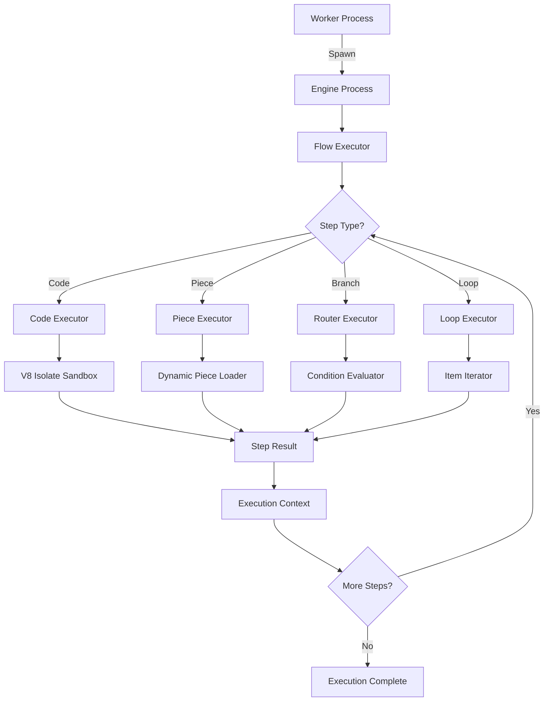

The execution engine is the core component that processes workflows step-by-step. It handles code execution, piece actions, branching logic, and loops with robust error handling.

## Engine Overview

The engine is a separate Node.js process that:

- **Loads** flow definitions from the database
- **Executes** steps sequentially or in parallel
- **Handles** branching (routers) and loops
- **Sandboxes** code execution using isolated-vm
- **Manages** piece (integration) execution
- **Stores** execution results

**Location**: `packages/server/engine/`

**Entry Point**: `src/main.ts`

**Executable**: `dist/packages/engine/main.js`

<Info>
The engine is spawned as a child process by workers, providing isolation and better resource management.
</Info>

## Engine Architecture



## Execution Flow

### Step-by-Step Process

<Steps>
  <Step title="Initialize">
    Engine receives execution request from worker:
    
    ```typescript
    {
      flowVersionId: string,
      projectId: string,
      payload: unknown,
      executionType: ExecutionType
    }
    ```
  </Step>
  
  <Step title="Load Flow">
    Fetch flow version from database:
    
    ```typescript
    const flowVersion = await flowVersionService.getOne(flowVersionId)
    const trigger = flowVersion.trigger
    const steps = flowVersion.actions  // Array of steps
    ```
  </Step>
  
  <Step title="Initialize Context">
    Create execution context:
    
    ```typescript
    const context = {
      steps: {},      // Step results
      trigger: payload,  // Trigger data
      connections: {}, // OAuth tokens
      vars: {}        // Environment variables
    }
    ```
  </Step>
  
  <Step title="Execute Steps">
    Process each step in order:
    
    - Resolve input variables from context
    - Execute step (code/piece/branch/loop)
    - Store result in context
    - Handle errors with retries
  </Step>
  
  <Step title="Return Result">
    Return execution result to worker:
    
    ```typescript
    {
      status: 'SUCCESS' | 'FAILED',
      duration: number,
      steps: Record<string, StepResult>
    }
    ```
  </Step>
</Steps>

## Step Executors

### Code Executor

**Purpose**: Execute custom JavaScript/TypeScript code

**Location**: `src/lib/handler/code-executor.ts`

**Sandboxing**: Uses isolated-vm for security

```typescript
const codeExecutor = {
  async handle({ step, context }) {
    const { sourceCode } = step.settings
    
    // Prepare inputs
    const inputs = {
      ...context.trigger,
      ...context.steps
    }
    
    // Execute in sandbox
    const result = await codeSandbox.runCodeModule({
      codeModule: { code: sourceCode },
      inputs
    })
    
    return {
      output: result,
      success: true
    }
  }
}
```

**Sandbox Configuration**:

```typescript
// v8-isolate-code-sandbox.ts:22
const isolate = new ivm.Isolate({ 
  memoryLimit: 128  // MB (configurable via AP_SANDBOX_MEMORY_LIMIT)
})
```

**Security Features**:
- **Memory Limit**: 128MB default (prevents DoS)
- **No File Access**: Cannot read/write files
- **No Network**: Cannot make HTTP requests (use pieces instead)
- **CPU Timeout**: Execution time limits
- **Isolated Heap**: Separate V8 heap per execution

### Piece Executor

**Purpose**: Execute integration actions (Slack, Gmail, etc.)

**Location**: `src/lib/handler/piece-executor.ts`

**Dynamic Loading**: Pieces loaded at runtime

```typescript
const pieceExecutor = {
  async handle({ step, context }) {
    const { pieceName, actionName, input } = step.settings
    
    // Load piece dynamically
    const piece = await pieceLoader.load(pieceName)
    const action = piece.actions[actionName]
    
    // Resolve input variables
    const resolvedInput = resolveVariables(input, context)
    
    // Execute action
    const result = await action.run({
      input: resolvedInput,
      auth: context.connections[pieceName],
      propsValue: resolvedInput
    })
    
    return {
      output: result,
      success: true
    }
  }
}
```

**Piece Structure**:

```typescript
export const slackPiece = {
  name: 'slack',
  displayName: 'Slack',
  auth: OAuth2PropertyValue,
  
  actions: {
    send_message: {
      name: 'send_message',
      displayName: 'Send Message',
      description: 'Send a message to a Slack channel',
      
      props: {
        channel: Property.ShortText({
          displayName: 'Channel',
          required: true
        }),
        text: Property.LongText({
          displayName: 'Message',
          required: true
        })
      },
      
      async run({ auth, propsValue }) {
        const response = await httpClient.post(
          'https://slack.com/api/chat.postMessage',
          {
            channel: propsValue.channel,
            text: propsValue.text
          },
          {
            headers: {
              'Authorization': `Bearer ${auth.access_token}`
            }
          }
        )
        return response.body
      }
    }
  }
}
```

### Router Executor

**Purpose**: Conditional branching based on expressions

**Location**: `src/lib/handler/router-executor.ts`

**Logic**: Evaluates conditions and executes matching branch

```typescript
const routerExecutor = {
  async handle({ step, context }) {
    const { branches } = step.settings
    
    // Evaluate each branch condition
    for (const branch of branches) {
      const conditionMet = await evaluateCondition(
        branch.condition,
        context
      )
      
      if (conditionMet) {
        // Execute branch steps
        const branchResult = await executeSteps(
          branch.steps,
          context
        )
        
        return {
          output: branchResult,
          success: true,
          selectedBranch: branch.name
        }
      }
    }
    
    // No condition met - execute default branch
    return {
      output: null,
      success: true,
      selectedBranch: 'default'
    }
  }
}
```

**Condition Types**:
- **Equals**: `{{trigger.status}} == 'active'`
- **Contains**: `{{trigger.tags}} contains 'urgent'`
- **Greater Than**: `{{trigger.amount}} > 100`
- **Exists**: `{{trigger.email}} exists`

### Loop Executor

**Purpose**: Iterate over arrays and execute steps for each item

**Location**: `src/lib/handler/loop-executor.ts`

**Execution**: Sequential or parallel iteration

```typescript
const loopExecutor = {
  async handle({ step, context }) {
    const { items, steps } = step.settings
    
    // Resolve items array from context
    const itemsArray = resolveVariable(items, context)
    
    const results = []
    
    // Iterate over items
    for (const [index, item] of itemsArray.entries()) {
      // Create loop context
      const loopContext = {
        ...context,
        loop: {
          item,
          index,
          total: itemsArray.length
        }
      }
      
      // Execute loop steps
      const stepResults = await executeSteps(
        steps,
        loopContext
      )
      
      results.push(stepResults)
    }
    
    return {
      output: results,
      success: true,
      iterations: results.length
    }
  }
}
```

**Loop Variables**:
- `{{loop.item}}`: Current item
- `{{loop.index}}`: Current index (0-based)
- `{{loop.total}}`: Total items

## Execution Context

### Context Structure

```typescript
interface ExecutionContext {
  // Trigger data
  trigger: unknown
  
  // Step outputs (by step name)
  steps: Record<string, StepOutput>
  
  // OAuth tokens and API keys
  connections: Record<string, Connection>
  
  // Environment variables
  vars: Record<string, string>
  
  // Loop state (if inside loop)
  loop?: {
    item: unknown
    index: number
    total: number
  }
  
  // Parent run (for child flows)
  parent?: {
    runId: string
    output: unknown
  }
}
```

### Variable Resolution

Engine resolves `{{variable}}` syntax:

```typescript
// Input
const input = {
  channel: "{{trigger.channel_id}}",
  message: "User {{trigger.user.name}} says: {{trigger.text}}"
}

// Context
const context = {
  trigger: {
    channel_id: "C123456",
    user: { name: "Alice" },
    text: "Hello!"
  }
}

// Resolved
const resolved = {
  channel: "C123456",
  message: "User Alice says: Hello!"
}
```

**Resolution Rules**:
- Nested properties: `{{trigger.user.email}}`
- Array access: `{{trigger.items[0].name}}`
- Step outputs: `{{send_email.message_id}}`
- System vars: `{{vars.API_KEY}}`

## Error Handling

### Error Types

<Tabs>
  <Tab title="Step Errors">
    Errors within a specific step:
    
    ```typescript
    {
      type: 'STEP_ERROR',
      stepName: 'send_email',
      message: 'Failed to send email',
      details: {
        statusCode: 429,
        error: 'Rate limit exceeded'
      }
    }
    ```
    
    **Handling**:
    - Retry with exponential backoff
    - Continue to error handler step
    - Mark run as failed
  </Tab>
  
  <Tab title="Timeout Errors">
    Execution exceeds time limit:
    
    ```typescript
    {
      type: 'TIMEOUT_ERROR',
      timeout: 600,  // seconds
      elapsed: 610
    }
    ```
    
    **Configure**:
    ```bash
    AP_FLOW_TIMEOUT_SECONDS=600
    ```
  </Tab>
  
  <Tab title="Sandbox Errors">
    Code execution errors:
    
    ```typescript
    {
      type: 'SANDBOX_ERROR',
      message: 'ReferenceError: foo is not defined',
      stack: '...'
    }
    ```
    
    **Common causes**:
    - Syntax errors
    - Reference errors
    - Out of memory
  </Tab>
</Tabs>

### Retry Strategy

```typescript
const retryConfig = {
  maxAttempts: 3,
  backoff: 'exponential',
  delays: [1000, 2000, 4000]  // ms
}
```

**Retryable Errors**:
- Network timeouts
- 429 Rate Limit
- 500 Server Error
- 503 Service Unavailable

**Non-retryable Errors**:
- 400 Bad Request
- 401 Unauthorized
- 404 Not Found
- Code syntax errors

## Performance Optimization

### Execution Mode

<Tabs>
  <Tab title="SANDBOX_CODE_ONLY (Production)">
    **Security**: High
    
    **Performance**: Moderate (V8 isolate overhead)
    
    ```bash
    AP_EXECUTION_MODE=SANDBOX_CODE_ONLY
    ```
    
    **Use for**: Production, untrusted code
  </Tab>
  
  <Tab title="UNSANDBOXED (Development)">
    **Security**: Low
    
    **Performance**: High (no isolation)
    
    ```bash
    AP_EXECUTION_MODE=UNSANDBOXED
    ```
    
    <Warning>
    Only use in development with trusted code!
    </Warning>
  </Tab>
</Tabs>

### Memory Limits

```bash .env
# Sandbox memory limit (MB)
AP_SANDBOX_MEMORY_LIMIT=128

# Increase for large data processing
AP_SANDBOX_MEMORY_LIMIT=512
```

### Timeouts

```bash .env
# Flow execution timeout
AP_FLOW_TIMEOUT_SECONDS=600

# Webhook timeout
AP_WEBHOOK_TIMEOUT_SECONDS=30

# Trigger timeout
AP_TRIGGER_TIMEOUT_SECONDS=300
```

### Caching

```bash .env
# Pre-load pieces into memory
AP_PRE_WARM_CACHE=true

# Piece cache size
AP_PIECES_CACHE_MAX_ENTRIES=1000
```

## Monitoring Execution

### Execution Logs

Engine writes detailed logs:

```json
{
  "level": "info",
  "msg": "Flow execution started",
  "flowVersionId": "abc123",
  "projectId": "proj456"
}

{
  "level": "debug",
  "msg": "Step executed",
  "stepName": "send_email",
  "duration": 234,
  "success": true
}

{
  "level": "info",
  "msg": "Flow execution completed",
  "duration": 1523,
  "status": "SUCCESS"
}
```

### Flow Run Entity

Stored in database:

```typescript
{
  id: string
  flowId: string
  flowVersionId: string
  projectId: string
  
  status: 'RUNNING' | 'SUCCESS' | 'FAILED' | 'TIMEOUT'
  
  startTime: Date
  finishTime: Date
  duration: number
  
  // Step execution details
  steps: {
    [stepName]: {
      type: string
      status: 'SUCCESS' | 'FAILED'
      input: unknown
      output: unknown
      duration: number
      errorMessage?: string
    }
  }
  
  // Execution metadata
  logsFileId?: string
  tags?: string[]
}
```

### Metrics

Track engine performance:

- **Execution time**: p50, p95, p99
- **Success rate**: successful / total
- **Error rate**: failed / total
- **Step duration**: per step type
- **Memory usage**: peak memory per execution

## Advanced Features

### Child Flows

Execute flows within flows:

```typescript
{
  type: 'PIECE',
  settings: {
    pieceName: 'activepieces',
    actionName: 'execute_flow',
    input: {
      flowId: 'child-flow-id',
      payload: {
        data: '{{trigger.data}}'
      }
    }
  }
}
```

**Features**:
- Pass data from parent to child
- Wait for child completion
- Access child output: `{{execute_flow.output}}`
- Fail parent on child failure

### Parallel Execution

**Not currently supported** - steps execute sequentially

**Workaround**: Use loops with async pieces

### Step Dependencies

Steps can reference previous step outputs:

```typescript
// Step 1: Fetch users
{
  name: 'fetch_users',
  output: [
    { id: 1, name: 'Alice' },
    { id: 2, name: 'Bob' }
  ]
}

// Step 2: Loop over users
{
  name: 'process_users',
  type: 'LOOP',
  settings: {
    items: '{{fetch_users.output}}',
    steps: [
      {
        name: 'send_email',
        settings: {
          to: '{{loop.item.email}}',
          subject: 'Hello {{loop.item.name}}'
        }
      }
    ]
  }
}
```

## Troubleshooting

<AccordionGroup>
  <Accordion title="Execution timeout">
    **Symptoms**: Flows fail with timeout error
    
    **Solutions**:
    ```bash
    # Increase timeout
    AP_FLOW_TIMEOUT_SECONDS=1200
    
    # Optimize workflow:
    # - Reduce HTTP retries
    # - Use pagination
    # - Split into multiple flows
    ```
  </Accordion>
  
  <Accordion title="Out of memory errors">
    **Symptoms**: Code steps fail with OOM
    
    **Solutions**:
    ```bash
    # Increase sandbox memory
    AP_SANDBOX_MEMORY_LIMIT=256
    
    # Process data in batches
    # Use loops instead of processing arrays at once
    ```
  </Accordion>
  
  <Accordion title="Variable resolution errors">
    **Symptoms**: `{{variable}}` not resolving
    
    **Check**:
    1. Variable exists in context
    2. Correct syntax: `{{step.output.field}}`
    3. Step executed before reference
    
    **Debug**:
    ```typescript
    // Add logging step
    console.log(JSON.stringify(context, null, 2))
    ```
  </Accordion>
</AccordionGroup>

## Next Steps

<CardGroup cols={2}>
  <Card title="Workers" icon="users" href="/deployment/workers">
    Understand worker architecture
  </Card>
  <Card title="Scaling" icon="chart-line" href="/deployment/scaling">
    Scale execution capacity
  </Card>
  <Card title="Architecture" icon="diagram-project" href="/deployment/architecture">
    System architecture overview
  </Card>
  <Card title="Environment Variables" icon="gear" href="/deployment/environment-variables">
    Configure engine settings
  </Card>
</CardGroup>