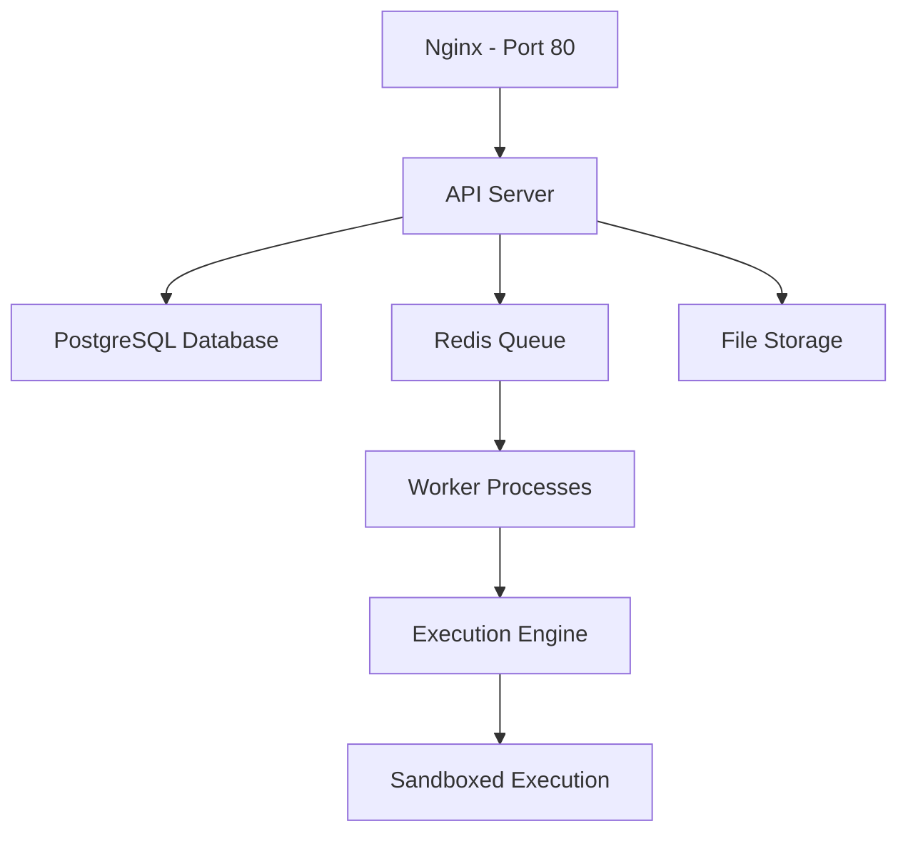

Activepieces is a self-hosted workflow automation platform that you can deploy in your own infrastructure. This gives you complete control over your data and workflows.

## Deployment Options

Activepieces offers flexible deployment options to suit different use cases:

<CardGroup cols={2}>
  <Card title="Docker" icon="docker" href="/deployment/docker">
    Quick single-container deployment for development and small-scale production
  </Card>
  <Card title="Docker Compose" icon="layer-group" href="/deployment/docker-compose">
    Multi-container setup with PostgreSQL and Redis for production use
  </Card>
  <Card title="Kubernetes" icon="dharmachakra" href="/deployment/kubernetes">
    Scalable production deployment using Helm charts
  </Card>
  <Card title="Cloud Platforms" icon="cloud">
    Deploy on AWS, GCP, Azure, or DigitalOcean
  </Card>
</CardGroup>

## Self-Hosted vs Cloud

<Tabs>
  <Tab title="Self-Hosted">
    ### Benefits
    - **Full Control**: Complete ownership of your data and infrastructure
    - **Customization**: Modify and extend the platform as needed
    - **Privacy**: Keep sensitive workflows and data within your network
    - **Cost**: No subscription fees for the Community Edition

    ### Requirements
    - Server infrastructure to host the application
    - Technical expertise to manage deployments
    - Responsibility for updates and maintenance
  </Tab>
  <Tab title="Cloud (Managed)">
    ### Benefits
    - **No Setup**: Start building workflows immediately
    - **Automatic Updates**: Always running the latest version
    - **Managed Infrastructure**: No server management needed
    - **Support**: Access to Activepieces team support

    ### Considerations
    - Data is hosted by Activepieces
    - Monthly subscription required
    - Less customization options
  </Tab>
</Tabs>

## System Requirements

### Minimum Requirements

For small deployments (< 100 workflows):

- **CPU**: 2 cores
- **RAM**: 4 GB
- **Storage**: 10 GB SSD
- **OS**: Linux (Ubuntu 20.04+, Debian 11+, etc.)

### Recommended Requirements

For production deployments (> 100 workflows):

- **CPU**: 4+ cores
- **RAM**: 8+ GB
- **Storage**: 50+ GB SSD
- **OS**: Linux (Ubuntu 22.04 LTS recommended)

### Dependencies

Activepieces requires the following services:

<Steps>
  <Step title="PostgreSQL 14+">
    Primary database for storing workflows, executions, and user data
    
    - **Minimum**: PostgreSQL 14
    - **Recommended**: PostgreSQL 15 or 16
    - SQLite can be used for development only
  </Step>
  <Step title="Redis 7+">
    Job queue management using BullMQ
    
    - **Minimum**: Redis 7.0
    - **Recommended**: Redis 7.2+
    - Required for production deployments
  </Step>
  <Step title="Node.js Runtime">
    Built into the Docker image
    
    - Node.js 20.x (included in container)
    - Bun 1.3.1 for package management
  </Step>
</Steps>

## Architecture Components

Activepieces consists of several key components:



### Component Breakdown

<AccordionGroup>
  <Accordion title="API Server" icon="server">
    The main application server that handles:
    - User authentication and authorization
    - Flow management (CRUD operations)
    - Webhook endpoints
    - REST API for integrations
    - Background job scheduling

    Runs on Node.js with Fastify framework.
  </Accordion>

  <Accordion title="Frontend (Nginx)" icon="window">
    Static web application served by Nginx:
    - Angular-based UI
    - Flow builder interface
    - Execution logs viewer
    - Configuration management

    Served on port 80 by default.
  </Accordion>

  <Accordion title="Execution Engine" icon="gears">
    Workflow execution runtime:
    - Processes flow steps sequentially
    - Handles code execution with isolated-vm
    - Manages piece (integration) execution
    - Error handling and retries

    Located at `dist/packages/engine/main.js`
  </Accordion>

  <Accordion title="Workers" icon="users">
    Background job processors using BullMQ:
    - Flow execution jobs
    - Scheduled triggers (polling)
    - Webhook renewals
    - User interaction jobs

    Can be scaled horizontally for high throughput.
  </Accordion>
</AccordionGroup>

## Execution Modes

Activepieces supports different execution modes for running workflows:

<CodeGroup>
```bash Sandboxed (Recommended)
AP_EXECUTION_MODE=SANDBOX_CODE_ONLY
```

```bash Unsandboxed (Development)
AP_EXECUTION_MODE=UNSANDBOXED
```
</CodeGroup>

<Info>
**Sandboxed execution** uses isolated-vm to run code in a secure V8 isolate with memory limits (128MB per execution). This is recommended for production to prevent malicious code from affecting the host system.
</Info>

<Warning>
**Unsandboxed execution** runs code directly in the Node.js process. Only use this for development or trusted environments.
</Warning>

## Next Steps

Choose your deployment method:

<CardGroup cols={3}>
  <Card title="Quick Start" icon="rocket" href="/deployment/docker">
    Get started with Docker in 5 minutes
  </Card>
  <Card title="Production Setup" icon="building" href="/deployment/docker-compose">
    Deploy with Docker Compose
  </Card>
  <Card title="Enterprise Scale" icon="chart-line" href="/deployment/kubernetes">
    Kubernetes deployment guide
  </Card>
</CardGroup>