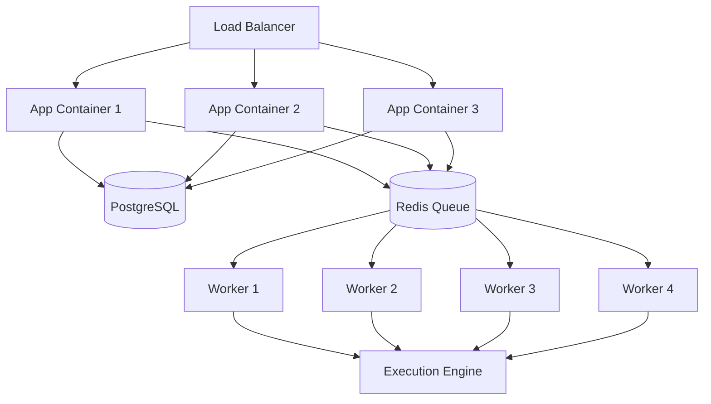

As your workflow automation needs grow, you can scale Activepieces to handle more concurrent executions and higher throughput. This guide covers horizontal scaling strategies.

## Scaling Architecture

Activepieces can be scaled by separating concerns into specialized containers:



## Container Types

Activepieces supports three container types via the `AP_CONTAINER_TYPE` environment variable:

<Tabs>
  <Tab title="WORKER_AND_APP (Default)">
    **All-in-one container**
    
    Runs both API server and background workers:
    
    ```bash
    AP_CONTAINER_TYPE=WORKER_AND_APP
    ```
    
    **Use for**:
    - Development
    - Small deployments (< 100 workflows)
    - Single server setups
    
    **Pros**:
    - Simple configuration
    - Minimal resource overhead
    
    **Cons**:
    - Limited scalability
    - API and workers compete for resources
  </Tab>
  
  <Tab title="APP">
    **API server only**
    
    Handles HTTP requests, doesn't process jobs:
    
    ```bash
    AP_CONTAINER_TYPE=APP
    ```
    
    **Responsibilities**:
    - Serve web UI
    - Handle API requests
    - Schedule jobs to Redis
    - Webhook endpoints
    
    **Scaling**: Multiple replicas behind load balancer
  </Tab>
  
  <Tab title="WORKER">
    **Background worker only**
    
    Processes jobs from queue, no HTTP endpoints:
    
    ```bash
    AP_CONTAINER_TYPE=WORKER
    AP_WORKER_CONCURRENCY=4
    ```
    
    **Responsibilities**:
    - Execute workflows
    - Process scheduled triggers
    - Handle polling triggers
    - Renew webhooks
    
    **Scaling**: Multiple workers for parallel execution
  </Tab>
</Tabs>

## Horizontal Scaling Strategies

### Strategy 1: Multiple All-in-One Instances

**Simple scaling** - Run multiple `WORKER_AND_APP` containers:

```yaml docker-compose.yml
services:
  activepieces-1:
    image: ghcr.io/activepieces/activepieces:0.79.0
    env_file: .env
    ports:
      - "8081:80"
      
  activepieces-2:
    image: ghcr.io/activepieces/activepieces:0.79.0
    env_file: .env
    ports:
      - "8082:80"
      
  activepieces-3:
    image: ghcr.io/activepieces/activepieces:0.79.0
    env_file: .env
    ports:
      - "8083:80"
      
  nginx:
    image: nginx:alpine
    ports:
      - "8080:80"
    volumes:
      - ./nginx.conf:/etc/nginx/nginx.conf:ro
```

**Nginx load balancer**:

```nginx nginx.conf
upstream activepieces {
    server activepieces-1:80;
    server activepieces-2:80;
    server activepieces-3:80;
}

server {
    listen 80;
    
    location / {
        proxy_pass http://activepieces;
        proxy_http_version 1.1;
        proxy_set_header Upgrade $http_upgrade;
        proxy_set_header Connection 'upgrade';
        proxy_set_header Host $host;
        proxy_cache_bypass $http_upgrade;
    }
}
```

### Strategy 2: Separate APP and WORKER Containers

**Recommended for production** - Dedicated containers:

```yaml docker-compose.yml
services:
  # API Servers (scale for HTTP traffic)
  app-1:
    image: ghcr.io/activepieces/activepieces:0.79.0
    environment:
      AP_CONTAINER_TYPE: APP
      AP_PM2_ENABLED: "true"  # Enable clustering within container
    env_file: .env
    deploy:
      replicas: 3
      
  # Workers (scale for job processing)
  worker:
    image: ghcr.io/activepieces/activepieces:0.79.0
    environment:
      AP_CONTAINER_TYPE: WORKER
      AP_WORKER_CONCURRENCY: "4"
    env_file: .env
    deploy:
      replicas: 5
```

<Info>
**Benefits:**
- Scale API and workers independently
- Optimize resource allocation
- Better fault isolation
- Easier monitoring
</Info>

## Kubernetes Scaling

### Horizontal Pod Autoscaler

Automatically scale based on CPU/memory:

```yaml
apiVersion: autoscaling/v2
kind: HorizontalPodAutoscaler
metadata:
  name: activepieces-hpa
spec:
  scaleTargetRef:
    apiVersion: apps/v1
    kind: Deployment
    name: activepieces
  minReplicas: 3
  maxReplicas: 10
  metrics:
  - type: Resource
    resource:
      name: cpu
      target:
        type: Utilization
        averageUtilization: 80
  - type: Resource
    resource:
      name: memory
      target:
        type: Utilization
        averageUtilization: 80
```

### Helm Configuration

```yaml values.yaml
# Enable autoscaling
autoscaling:
  enabled: true
  minReplicas: 3
  maxReplicas: 10
  targetCPUUtilizationPercentage: 80
  targetMemoryUtilizationPercentage: 80

# Resource requests/limits
resources:
  requests:
    cpu: 500m
    memory: 2Gi
  limits:
    cpu: 2000m
    memory: 4Gi

# Pod anti-affinity (spread across nodes)
affinity:
  podAntiAffinity:
    preferredDuringSchedulingIgnoredDuringExecution:
    - weight: 100
      podAffinityTerm:
        labelSelector:
          matchLabels:
            app.kubernetes.io/name: activepieces
        topologyKey: kubernetes.io/hostname
```

## Worker Configuration

### Worker Concurrency

Control how many jobs each worker processes simultaneously:

```bash .env
AP_WORKER_CONCURRENCY=4
```

<ParamField path="AP_WORKER_CONCURRENCY" type="number">
  **Guidelines:**
  - **CPU-bound workflows**: `concurrency = CPU cores`
  - **I/O-bound workflows**: `concurrency = CPU cores × 2-4`
  - **Default**: 1 (safe default)
  
  **Example calculations**:
  - 2 CPU cores, CPU-intensive: `concurrency = 2`
  - 4 CPU cores, API calls/webhooks: `concurrency = 8-16`
</ParamField>

### PM2 Clustering

Enable process clustering within a container:

```bash .env
AP_CONTAINER_TYPE=APP
AP_PM2_ENABLED=true
```

<Info>
When `AP_PM2_ENABLED=true`, PM2 starts one process per CPU core using cluster mode with `-i 0`.

See `docker-entrypoint.sh:20` for implementation.
</Info>

## Database Scaling

### Connection Pooling

Adjust pool size based on instance count:

```bash
# Formula: (max_connections × 0.8) / instance_count
# Example: (100 × 0.8) / 4 = 20 per instance

AP_POSTGRES_POOL_SIZE=20
AP_POSTGRES_IDLE_TIMEOUT_MS=30000
```

### PostgreSQL Max Connections

Increase PostgreSQL max connections:

```bash
# postgresql.conf
max_connections = 200
```

Or for managed databases:

<Tabs>
  <Tab title="AWS RDS">
    Parameter Groups → `max_connections`
    
    Formula: `{DBInstanceClassMemory/9531392}`
  </Tab>
  
  <Tab title="Google Cloud SQL">
    Database flags → `max_connections`
    
    Automatic based on instance tier
  </Tab>
  
  <Tab title="Azure Database">
    Server parameters → `max_connections`
    
    Default: Based on vCores
  </Tab>
</Tabs>

### Read Replicas

Offload read queries to replicas:

```bash .env
AP_POSTGRES_HOST=primary-host
AP_POSTGRES_READ_REPLICA_HOST=replica-host
```

<Warning>
Activepieces doesn't currently support read replica configuration. Consider using connection poolers like PgBouncer instead.
</Warning>

## Redis Scaling

### Redis Cluster

For high-throughput deployments, use Redis Cluster:

```bash .env
AP_REDIS_TYPE=cluster
AP_REDIS_CLUSTER_NODES=redis-1:6379,redis-2:6379,redis-3:6379
```

### Redis Sentinel

For high availability:

```bash .env
AP_REDIS_TYPE=sentinel
AP_REDIS_SENTINEL_NAME=mymaster
AP_REDIS_SENTINEL_HOSTS=sentinel-1:26379,sentinel-2:26379,sentinel-3:26379
AP_REDIS_SENTINEL_ROLE=master
```

### Job Retention

Control queue memory usage:

```bash .env
# Keep failed jobs for 7 days
AP_REDIS_FAILED_JOB_RETENTION_DAYS=7

# Maximum 100 failed jobs
AP_REDIS_FAILED_JOB_RETENTION_MAX_COUNT=100
```

## Load Balancing

### Nginx

```nginx
upstream activepieces_app {
    least_conn;  # Least connections algorithm
    server app-1:80 max_fails=3 fail_timeout=30s;
    server app-2:80 max_fails=3 fail_timeout=30s;
    server app-3:80 max_fails=3 fail_timeout=30s;
}

server {
    listen 80;
    server_name activepieces.yourdomain.com;
    
    # Increase timeouts for long-running workflows
    proxy_read_timeout 600s;
    proxy_send_timeout 600s;
    
    location / {
        proxy_pass http://activepieces_app;
        proxy_http_version 1.1;
        
        # Preserve client IP
        proxy_set_header X-Real-IP $remote_addr;
        proxy_set_header X-Forwarded-For $proxy_add_x_forwarded_for;
        proxy_set_header X-Forwarded-Proto $scheme;
        
        # WebSocket support
        proxy_set_header Upgrade $http_upgrade;
        proxy_set_header Connection "upgrade";
    }
}
```

### Kubernetes Ingress

```yaml
apiVersion: networking.k8s.io/v1
kind: Ingress
metadata:
  name: activepieces
  annotations:
    nginx.ingress.kubernetes.io/proxy-read-timeout: "600"
    nginx.ingress.kubernetes.io/proxy-send-timeout: "600"
    nginx.ingress.kubernetes.io/proxy-body-size: "100m"
spec:
  ingressClassName: nginx
  rules:
  - host: activepieces.yourdomain.com
    http:
      paths:
      - path: /
        pathType: Prefix
        backend:
          service:
            name: activepieces
            port:
              number: 80
```

## Monitoring Scaling

### Metrics to Monitor

<AccordionGroup>
  <Accordion title="Queue Metrics" icon="list">
    Monitor Redis queue depth:
    
    ```bash
    # Using redis-cli
    redis-cli LLEN bull:activepieces:waiting
    redis-cli LLEN bull:activepieces:active
    redis-cli LLEN bull:activepieces:failed
    ```
    
    **Scale workers when**:
    - Waiting jobs > 100
    - Average wait time > 30s
  </Accordion>
  
  <Accordion title="Worker Utilization" icon="gauge">
    Monitor worker CPU/memory:
    
    ```bash
    # Docker
    docker stats --format "table {{.Container}}\t{{.CPUPerc}}\t{{.MemUsage}}"
    
    # Kubernetes
    kubectl top pods -l app=activepieces
    ```
    
    **Scale when**:
    - CPU > 80%
    - Memory > 80%
  </Accordion>
  
  <Accordion title="API Response Time" icon="clock">
    Monitor API latency:
    
    ```bash
    # Check health endpoint
    curl -w "@curl-format.txt" -o /dev/null -s http://localhost:8080/v1/health
    ```
    
    **Scale APP containers when**:
    - p95 latency > 500ms
    - Error rate > 1%
  </Accordion>
  
  <Accordion title="Database Connections" icon="database">
    Monitor PostgreSQL connections:
    
    ```sql
    SELECT count(*) FROM pg_stat_activity WHERE state = 'active';
    SELECT count(*) FROM pg_stat_activity;
    ```
    
    **Adjust when**:
    - Active > 80% of max
    - Connection errors in logs
  </Accordion>
</AccordionGroup>

### Queue UI

Enable BullMQ Board for visual monitoring:

```bash .env
AP_QUEUE_UI_ENABLED=true
AP_QUEUE_UI_USERNAME=admin
AP_QUEUE_UI_PASSWORD=secure_password
```

Access at: `http://your-domain/admin/queues`

## Performance Optimization

### Execution Mode

Use sandboxed execution for production:

```bash .env
AP_EXECUTION_MODE=SANDBOX_CODE_ONLY
```

### Timeouts

Adjust based on your workflow needs:

```bash .env
# Maximum workflow execution time
AP_FLOW_TIMEOUT_SECONDS=600  # 10 minutes

# Webhook timeout
AP_WEBHOOK_TIMEOUT_SECONDS=30

# Trigger polling interval
AP_TRIGGER_DEFAULT_POLL_INTERVAL=5  # minutes
```

### Caching

Enable piece caching:

```bash .env
AP_PIECES_CACHE_MAX_ENTRIES=1000
AP_PRE_WARM_CACHE=true
```

## Scaling Checklist

<Steps>
  <Step title="Database">
    - [ ] Increase `max_connections` in PostgreSQL
    - [ ] Adjust `AP_POSTGRES_POOL_SIZE` per instance
    - [ ] Enable connection pooling (PgBouncer)
    - [ ] Setup database replication for HA
  </Step>
  
  <Step title="Redis">
    - [ ] Configure Redis persistence
    - [ ] Setup Redis Sentinel/Cluster for HA
    - [ ] Monitor queue depth
    - [ ] Configure job retention
  </Step>
  
  <Step title="File Storage">
    - [ ] Migrate to S3 from local storage
    - [ ] Enable S3 signed URLs
    - [ ] Configure lifecycle policies
  </Step>
  
  <Step title="Application">
    - [ ] Separate APP and WORKER containers
    - [ ] Configure worker concurrency
    - [ ] Enable PM2 for APP containers
    - [ ] Setup load balancer
  </Step>
  
  <Step title="Monitoring">
    - [ ] Setup metrics collection
    - [ ] Configure autoscaling
    - [ ] Enable queue UI
    - [ ] Setup alerting
  </Step>
</Steps>

## Next Steps

<CardGroup cols={2}>
  <Card title="Workers" icon="users" href="/deployment/workers">
    Deep dive into worker architecture
  </Card>
  <Card title="Architecture" icon="diagram-project" href="/deployment/architecture">
    Understand system components
  </Card>
  <Card title="Database" icon="database" href="/deployment/database">
    Optimize database performance
  </Card>
  <Card title="Monitoring" icon="chart-bar">
    Setup monitoring and alerts
  </Card>
</CardGroup>