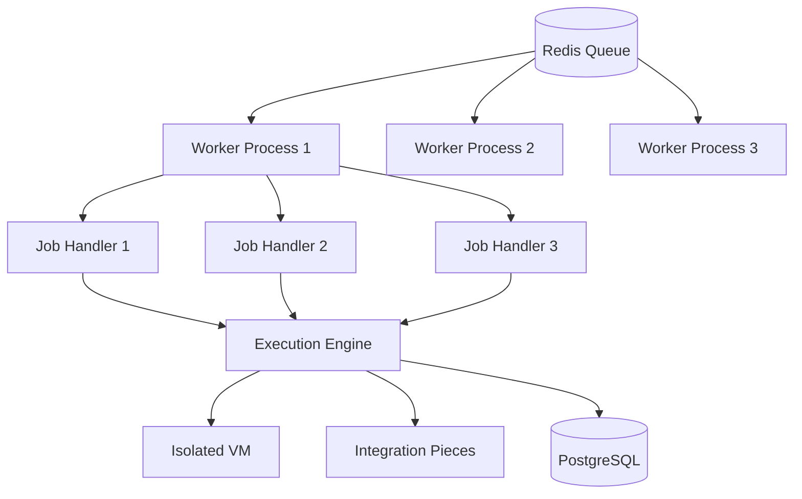
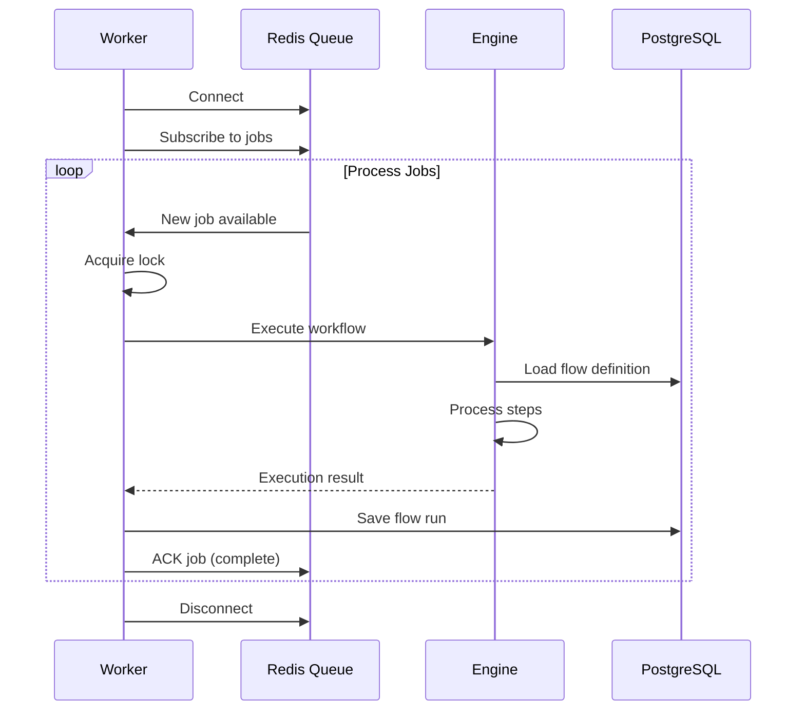
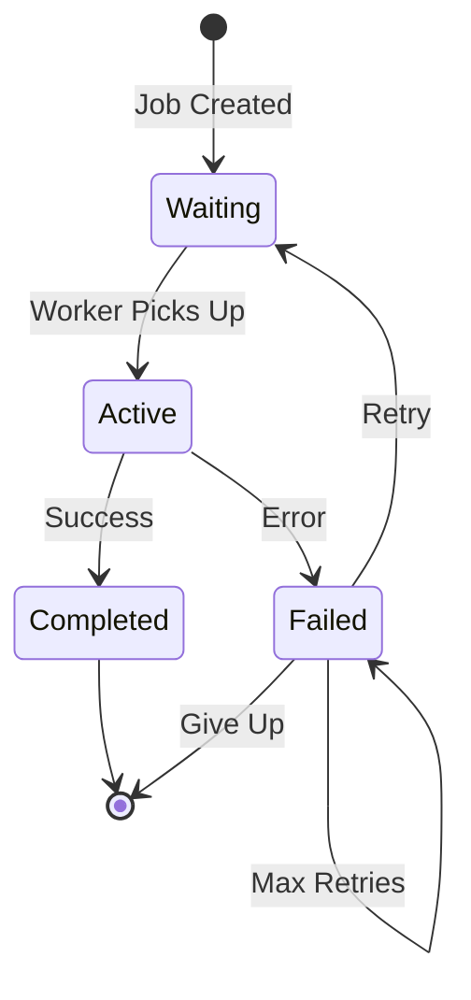

Workers are the backbone of Activepieces, responsible for executing workflows, processing triggers, and handling background tasks. This guide explains worker architecture and configuration.

## What are Workers?

Workers are Node.js processes that:
- **Consume jobs** from Redis queue (BullMQ)
- **Execute workflows** using the execution engine
- **Poll external APIs** for scheduled triggers
- **Renew webhooks** for trigger subscriptions
- **Process async tasks** (emails, notifications)

<Info>
Workers are separate from the API server, allowing independent scaling based on workload.
</Info>

## Worker Architecture



### Worker Process Lifecycle



## Job Types

Workers process different job types from the queue:

### 1. ExecuteFlowJob

<ParamField path="ExecuteFlowJob" type="job">
  **Purpose**: Execute a workflow instance
  
  **Triggered by**:
  - Webhooks
  - Manual runs
  - Scheduled triggers
  - Child flows
  
  **Data**:
  ```typescript
  {
    flowVersionId: string
    projectId: string
    payload: unknown
    executionType: ExecutionType
    httpRequestId?: string
    parentRunId?: string
  }
  ```
  
  **Processing**:
  1. Load flow version from database
  2. Spawn execution engine
  3. Pass flow definition and payload
  4. Collect execution result
  5. Save flow run to database
</ParamField>

### 2. PollingJob

<ParamField path="PollingJob" type="job">
  **Purpose**: Poll external API for new data
  
  **Triggered by**: Cron schedule (default: every 5 minutes)
  
  **Data**:
  ```typescript
  {
    flowVersionId: string
    projectId: string
    triggerType: TriggerType.POLLING
  }
  ```
  
  **Processing**:
  1. Load trigger configuration
  2. Call piece's `onEnable` hook
  3. Fetch new items from API
  4. Deduplicate items
  5. Enqueue ExecuteFlowJob for each item
</ParamField>

### 3. WebhookJob

<ParamField path="WebhookJob" type="job">
  **Purpose**: Process webhook payload
  
  **Triggered by**: Incoming webhook HTTP request
  
  **Data**:
  ```typescript
  {
    flowVersionId: string
    payload: unknown
    httpRequestId: string
  }
  ```
  
  **Processing**:
  1. Validate webhook signature
  2. Transform payload if needed
  3. Enqueue ExecuteFlowJob
</ParamField>

### 4. RenewWebhookJob

<ParamField path="RenewWebhookJob" type="job">
  **Purpose**: Renew webhook subscriptions
  
  **Triggered by**: Cron schedule (before expiration)
  
  **Data**:
  ```typescript
  {
    flowVersionId: string
    projectId: string
  }
  ```
  
  **Processing**:
  1. Call piece's renewal endpoint
  2. Update webhook registration
  3. Store new webhook URL/token
</ParamField>

### 5. UserInteractionJob

<ParamField path="UserInteractionJob" type="job">
  **Purpose**: Handle human-in-the-loop tasks
  
  **Data**:
  ```typescript
  {
    flowRunId: string
    stepName: string
    action: 'APPROVE' | 'REJECT'
  }
  ```
  
  **Processing**:
  1. Resume paused flow run
  2. Continue from approval step
  3. Complete execution
</ParamField>

## Worker Configuration

### Container Type

Control what runs in each container:

<Tabs>
  <Tab title="WORKER_AND_APP">
    **Default**: Both API and workers in one container
    
    ```bash .env
    AP_CONTAINER_TYPE=WORKER_AND_APP
    ```
    
    **Use for**:
    - Development
    - Small deployments
    - Single-server setups
    
    **Implementation** (from `docker-entrypoint.sh`):
    ```bash
    node --enable-source-maps packages/server/api/dist/src/bootstrap.js
    ```
  </Tab>
  
  <Tab title="APP">
    **API only**: No worker processing
    
    ```bash .env
    AP_CONTAINER_TYPE=APP
    AP_PM2_ENABLED=true  # Optional clustering
    ```
    
    **Use for**:
    - Scaling API servers horizontally
    - Separate API and worker concerns
    
    **Implementation**:
    ```bash
    if [ "$AP_CONTAINER_TYPE" = "APP" ] && [ "$AP_PM2_ENABLED" = "true" ]; then
        pm2-runtime start packages/server/api/dist/src/bootstrap.js \
          --name "activepieces-app" \
          --node-args="--enable-source-maps" \
          -i 0  # One process per CPU core
    fi
    ```
  </Tab>
  
  <Tab title="WORKER">
    **Workers only**: No API server
    
    ```bash .env
    AP_CONTAINER_TYPE=WORKER
    AP_WORKER_CONCURRENCY=4
    ```
    
    **Use for**:
    - Scaling workers independently
    - High-throughput deployments
    - Dedicated worker pools
  </Tab>
</Tabs>

### Worker Concurrency

<ParamField path="AP_WORKER_CONCURRENCY" type="number">
  Number of jobs processed simultaneously per worker
  
  **Formula**:
  - **CPU-bound workflows**: `concurrency = CPU cores`
  - **I/O-bound workflows**: `concurrency = CPU cores × 2-4`
  
  **Examples**:
  ```bash
  # 2 CPU cores, data processing
  AP_WORKER_CONCURRENCY=2
  
  # 4 CPU cores, API calls/webhooks
  AP_WORKER_CONCURRENCY=12
  ```
  
  **Trade-offs**:
  - Higher concurrency = more throughput
  - Higher concurrency = more memory usage
  - Too high = context switching overhead
</ParamField>

### Worker Token (Dedicated Workers)

<ParamField path="AP_WORKER_TOKEN" type="string">
  Authentication token for dedicated worker deployments
  
  ```bash .env
  # Main app
  AP_CONTAINER_TYPE=APP
  
  # Dedicated worker
  AP_CONTAINER_TYPE=WORKER
  AP_WORKER_TOKEN=secure_random_token
  ```
  
  Used to authenticate worker API calls to main app.
</ParamField>

## BullMQ Integration

Activepieces uses BullMQ for job queue management.

### Queue Structure

**Location**: `app/workers/queue/queue-manager.ts`

Queue configuration:

```typescript
const queue = new Queue('activepieces', {
  connection: redis,
  defaultJobOptions: {
    attempts: 3,
    backoff: {
      type: 'exponential',
      delay: 1000  // Start with 1 second
    },
    removeOnComplete: {
      age: 3600  // Keep for 1 hour
    },
    removeOnFail: {
      age: 86400 * 7  // Keep for 7 days
    }
  }
})
```

### Job Lifecycle



### Job Priorities

```typescript
// High priority (webhooks)
await queue.add('execute-flow', data, {
  priority: 1
})

// Normal priority (scheduled)
await queue.add('polling', data, {
  priority: 5
})

// Low priority (maintenance)
await queue.add('cleanup', data, {
  priority: 10
})
```

### Delayed Jobs

```typescript
// Execute after 1 hour
await queue.add('execute-flow', data, {
  delay: 3600000  // ms
})
```

### Repeating Jobs

```typescript
// Poll every 5 minutes
await queue.add('polling', data, {
  repeat: {
    every: 300000,  // 5 minutes in ms
    immediately: true
  }
})

// Cron schedule
await queue.add('cleanup', data, {
  repeat: {
    pattern: '0 2 * * *'  // 2 AM daily
  }
})
```

## Worker Scaling

### Horizontal Scaling

Add more worker containers:

```yaml docker-compose.yml
services:
  worker-1:
    image: ghcr.io/activepieces/activepieces:0.79.0
    environment:
      AP_CONTAINER_TYPE: WORKER
      AP_WORKER_CONCURRENCY: "4"
    env_file: .env
    
  worker-2:
    image: ghcr.io/activepieces/activepieces:0.79.0
    environment:
      AP_CONTAINER_TYPE: WORKER
      AP_WORKER_CONCURRENCY: "4"
    env_file: .env
    
  worker-3:
    image: ghcr.io/activepieces/activepieces:0.79.0
    environment:
      AP_CONTAINER_TYPE: WORKER
      AP_WORKER_CONCURRENCY: "4"
    env_file: .env
```

### Kubernetes Scaling

```yaml
apiVersion: apps/v1
kind: Deployment
metadata:
  name: activepieces-worker
spec:
  replicas: 5
  selector:
    matchLabels:
      app: activepieces-worker
  template:
    metadata:
      labels:
        app: activepieces-worker
    spec:
      containers:
      - name: worker
        image: ghcr.io/activepieces/activepieces:0.79.0
        env:
        - name: AP_CONTAINER_TYPE
          value: "WORKER"
        - name: AP_WORKER_CONCURRENCY
          value: "4"
        resources:
          requests:
            cpu: 1000m
            memory: 2Gi
          limits:
            cpu: 2000m
            memory: 4Gi
```

### Auto-scaling Rules

Scale based on queue depth:

```yaml
apiVersion: autoscaling/v2
kind: HorizontalPodAutoscaler
metadata:
  name: worker-hpa
spec:
  scaleTargetRef:
    apiVersion: apps/v1
    kind: Deployment
    name: activepieces-worker
  minReplicas: 2
  maxReplicas: 20
  metrics:
  - type: External
    external:
      metric:
        name: redis_queue_length
      target:
        type: AverageValue
        averageValue: "100"  # Scale when >100 jobs/worker
```

## Monitoring Workers

### Queue Metrics

Check queue health:

```bash
# Queue depth
redis-cli LLEN bull:activepieces:waiting

# Active jobs
redis-cli LLEN bull:activepieces:active

# Failed jobs
redis-cli LLEN bull:activepieces:failed

# Completed jobs
redis-cli LLEN bull:activepieces:completed
```

### Queue UI

Enable BullMQ Board for visual monitoring:

```bash .env
AP_QUEUE_UI_ENABLED=true
AP_QUEUE_UI_USERNAME=admin
AP_QUEUE_UI_PASSWORD=secure_password
```

Access at: `http://your-domain/admin/queues`

**Features**:
- View waiting/active/failed jobs
- Retry failed jobs
- Remove jobs
- View job data and stack traces
- Queue statistics

### Logs

Monitor worker logs:

```bash
# Docker Compose
docker compose logs -f worker

# Kubernetes
kubectl logs -f deployment/activepieces-worker
```

### Metrics API

Activepieces exposes queue metrics:

```bash
curl http://localhost:3000/api/v1/admin/queue/metrics
```

Response:
```json
{
  "waiting": 42,
  "active": 8,
  "completed": 1523,
  "failed": 12,
  "delayed": 0,
  "paused": 0
}
```

## Performance Tuning

### Redis Configuration

Optimize Redis for queue performance:

```conf redis.conf
# Memory
maxmemory 2gb
maxmemory-policy allkeys-lru

# Persistence (optional)
save 900 1
save 300 10
save 60 10000

# Networking
tcp-backlog 511
timeout 0
```

### Worker Optimization

<CardGroup cols={2}>
  <Card title="Increase Concurrency" icon="gauge-high">
    For I/O-bound workflows:
    
    ```bash
    AP_WORKER_CONCURRENCY=16
    ```
  </Card>
  
  <Card title="Pre-warm Cache" icon="fire">
    Load pieces into memory on startup:
    
    ```bash
    AP_PRE_WARM_CACHE=true
    ```
  </Card>
  
  <Card title="Adjust Timeouts" icon="clock">
    Increase for long-running workflows:
    
    ```bash
    AP_FLOW_TIMEOUT_SECONDS=1200
    ```
  </Card>
  
  <Card title="Resource Limits" icon="memory">
    Set Docker resource limits:
    
    ```yaml
    deploy:
      resources:
        limits:
          cpus: '2'
          memory: 4G
    ```
  </Card>
</CardGroup>

## Error Handling

### Retry Strategy

BullMQ retries failed jobs automatically:

```typescript
{
  attempts: 3,
  backoff: {
    type: 'exponential',
    delay: 1000  // 1s, 2s, 4s
  }
}
```

### Failed Job Retention

Configure how long to keep failed jobs:

```bash .env
AP_REDIS_FAILED_JOB_RETENTION_DAYS=7
AP_REDIS_FAILED_JOB_RETENTION_MAX_COUNT=100
```

### Dead Letter Queue

After max retries, jobs move to failed queue:

```bash
# View failed jobs
redis-cli LRANGE bull:activepieces:failed 0 -1

# Manually retry
curl -X POST http://localhost:3000/api/v1/admin/queue/retry/:jobId
```

## Best Practices

<AccordionGroup>
  <Accordion title="Separate APP and WORKER" icon="split">
    Use dedicated containers for production:
    
    **Benefits**:
    - Independent scaling
    - Resource optimization
    - Better fault isolation
    - Easier monitoring
  </Accordion>
  
  <Accordion title="Monitor Queue Depth" icon="chart-line">
    Alert when queue grows:
    
    ```bash
    # Alert if waiting > 1000
    if [ $(redis-cli LLEN bull:activepieces:waiting) -gt 1000 ]; then
      alert "Queue backlog detected"
    fi
    ```
  </Accordion>
  
  <Accordion title="Set Resource Limits" icon="gauge">
    Prevent memory leaks:
    
    ```yaml
    resources:
      limits:
        memory: 4Gi
    ```
  </Accordion>
  
  <Accordion title="Enable Queue UI" icon="chart-bar">
    Visual debugging:
    
    ```bash
    AP_QUEUE_UI_ENABLED=true
    ```
  </Accordion>
</AccordionGroup>

## Troubleshooting

<AccordionGroup>
  <Accordion title="Jobs stuck in waiting">
    **Symptoms**: Jobs not processing
    
    **Check**:
    1. Workers running: `docker ps | grep worker`
    2. Redis connection: `redis-cli ping`
    3. Worker logs for errors
    
    **Fix**:
    ```bash
    # Restart workers
    docker compose restart worker
    ```
  </Accordion>
  
  <Accordion title="High memory usage">
    **Symptoms**: Workers consuming too much RAM
    
    **Check**:
    1. Worker concurrency: `AP_WORKER_CONCURRENCY`
    2. Workflow complexity
    3. Memory leaks in custom code
    
    **Fix**:
    ```bash
    # Reduce concurrency
    AP_WORKER_CONCURRENCY=2
    
    # Set memory limits
    AP_SANDBOX_MEMORY_LIMIT=128
    ```
  </Accordion>
  
  <Accordion title="Jobs failing repeatedly">
    **Symptoms**: Many jobs in failed queue
    
    **Check**:
    1. Failed job details in Queue UI
    2. Worker logs for stack traces
    3. External API availability
    
    **Fix**:
    ```bash
    # View failed job
    redis-cli LINDEX bull:activepieces:failed 0
    
    # Increase timeout
    AP_FLOW_TIMEOUT_SECONDS=600
    ```
  </Accordion>
</AccordionGroup>

## Next Steps

<CardGroup cols={2}>
  <Card title="Engine" icon="gears" href="/deployment/engine">
    Understand execution engine
  </Card>
  <Card title="Scaling" icon="chart-line" href="/deployment/scaling">
    Scale workers horizontally
  </Card>
  <Card title="Architecture" icon="diagram-project" href="/deployment/architecture">
    System architecture overview
  </Card>
  <Card title="Monitoring" icon="chart-bar">
    Setup monitoring and alerts
  </Card>
</CardGroup>